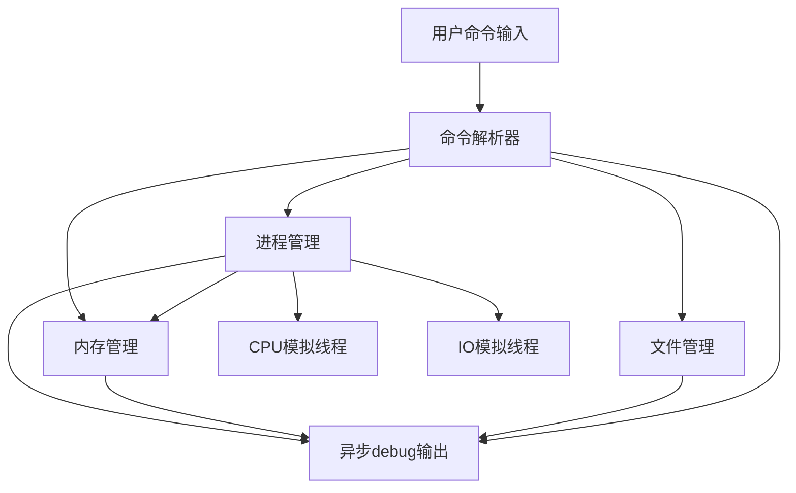

# 1. 实验名称

操作系统核心功能模拟实验

# 2. 实验目的

- 理解操作系统中进程管理、内存分配、外存管理及文件系统的基本原理与机制。
- 掌握进程调度（RR算法）、内存分配（异步分区管理）、文件管理（索引分配/连续分配）等核心功能的编程实现。
- 提高模块化设计能力，锻炼多线程、生产者-消费者、异步与并发控制等编程技能。

# 3. 实验内容

实现一个操作系统模拟程序，支持如下命令及功能：

1. 进程创建、终止、查询与调度（支持I/O阻塞与RR调度）。
2. 内存分配与释放（支持分区合并、异步内存管理、乐观锁同步）。
3. 文件创建、删除、查询（模拟FCB、支持索引分配）。
4. 支持良好的命令交互，命令包括：`creatproc`, `killproc`, `psproc`, `mem`, `creatfile`, `deletefile`, `lsfile,help`。
5. 支持异步debug输出，内容颜色分明、直观展示。
6. 所有模块低耦合，关注点分离，便于维护与扩展。

# 4. 实验设计过程

## 4.1 总体架构

本程序将操作系统的核心功能拆分为独立模块，包括：进程管理、内存管理、外存（文件）管理、命令解释器及异步debug输出。各模块之间通过明确定义的接口通信，耦合度低，易于调试与扩展。下图展示了主要模块及其交互关系：

### 4.2 进程实现

- **PCB结构**：保存进程ID、状态、内存块地址、I/O信息，是否被删除等。
- **调度算法**：采用时间片轮转（RR），通过CPU和IO线程定时切换进程。
- **阻塞/唤醒**：若进程有I/O操作，运行到I/O起始时进入阻塞队列，由IO线程模拟I/O完成后唤醒。
- **命令支持**：`creatproc`创建进程，`killproc`终止进程，`psproc`查询进程。

### 4.3 内存管理实现

- **内存模型**：用链表模拟物理内存，支持可变分区分配，采用首次适应算法。
- **分配算法**：分配内存时采用乐观锁实现多线程同步，避免竞争条件。
- **碎片整理**：释放内存后若碎片块过多，异步触发合并操作，采用copy-on-write与乐观锁保证合并安全高效。
- **异步管理**：内存分配与碎片合并可由独立线程处理，减小主线程阻塞。
- **命令支持**：`mem`显示内存使用状况，allocate_memory分配内存，free_mem释放内存。

### 4.4 外存管理实现

- **文件模型**：FCB结构保存文件名、文件ID，磁盘号，索引块号。
- **分配算法**：支持索引分配。
- **命令支持**：`creatfile`创建文件，`deletefile`删除文件，`lsfile`显示文件信息。

### 4.5 命令处理实现

- **交互界面**：命令行窗口，用户输入命令，解释器解析并分发给各模块。
- **命令解析**：支持参数检查和错误提示，未识别命令标红报错，同时支持help命令提示正确格式。
- **功能拓展**：新命令可无缝添加，便于功能扩展。

### 4.6 异步Debug器实现

- **生产者-消费者模型**：各模块(生产者)将事件写入debug队列，debug线程异步消费。
- **彩色输出**：不同事件类别（如进程、内存、文件操作）使用不同颜色输出，直观易读。
- **非阻塞**：debug输出不会阻塞主线程或核心操作，保证高并发下系统响应。
- **日志文件**：debug输出还会记录到log.txt文件中，实现日志文件同时也会标明时间

# 5. 代码及运行结果

## 5.1 开发环境

- 编程语言：C++
- 主要库：thread, list, condition_variable,atomic等
- 运行平台：Windows 11 vs2022

## 5.2 主要代码片段

> **说明**：代码已上传至[catdouyuan/csu-os](https://github.com/catdouyuan/csu-os)，以下为主要结构与关键函数示例。

## 5.3 进程调度与管理

**PCB结构:**

**进程调度接口:**

下面省略部分代码，只展示主要逻辑过程

### cpu进程调度：

### IO进程调度：

### 杀死进程：

### 展示进程：

### PCB接口

## 5.4 内存管理

### Mem主要成员以及接口：

### 分配内存：

### 释放内存：

### 整理内存：

### 展示内存使用情况：

## 5.5 文件管理

### FCB结构：

### 文件管理接口:

### 创建文件:

### 删除文件:

### 展示文件信息:

## 5.6 异步Debug输出

### Debug接口:

### 阻塞队列接口:

### Debug输出:

### 阻塞队列实现:

## 5.7 命令解析与主程序

# 6. 运行截图

## 6.1 进程运行结果:

### 创建进程：

### kill进程:

### 展示进程:

## 6.2 内存管理运行结果：

### 分配与展示内存使用:

### 内存整理结果：

**附：上面创建1000kb的进程之前内存块有三个 创建1000kb之后内存块就整理成1个了**

## 6.3 外存管理运行结果：

## 6.4 debug运行结果：

# 7. 总结与收获

- 本实验通过模块化、低耦合的架构，系统性地实现了操作系统的进程调度、内存管理、文件管理与命令解释等核心功能。
- 采用多线程模拟CPU与I/O，提高了系统的真实感和并发性。异步Debug输出不仅美观且有助于快速定位问题。
- 内存管理中的乐观锁与异步碎片整理机制有效防止了并发冲突和内存碎片膨胀，提升了系统健壮性。
- 各模块均可独立扩展或替换，体现了关注点分离和高内聚低耦合的设计思想。
- 通过本实验，进一步加深了对操作系统原理的理解，锻炼了多线程编程、并发控制、系统设计等能力。

---
